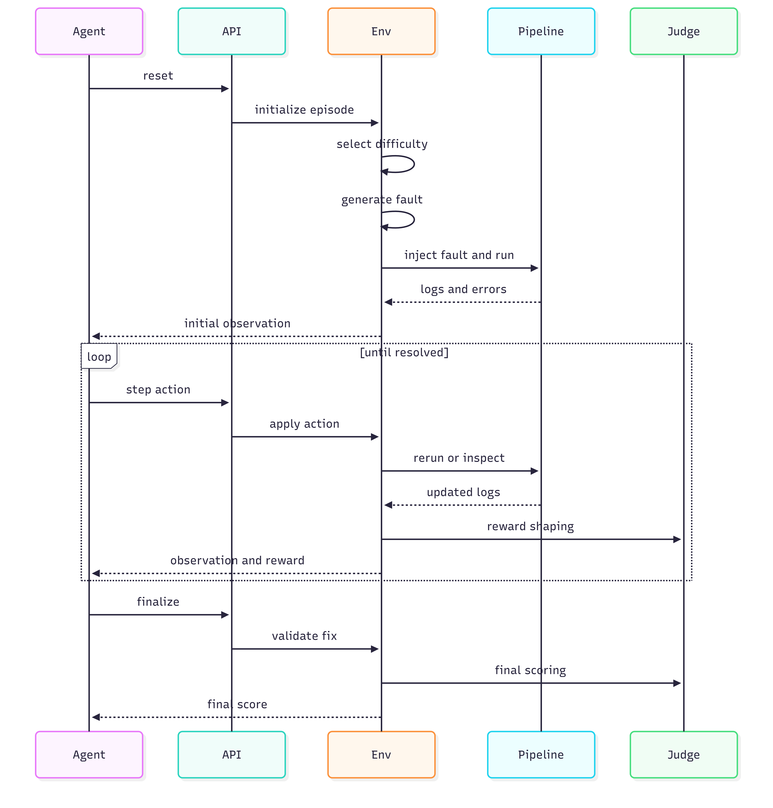
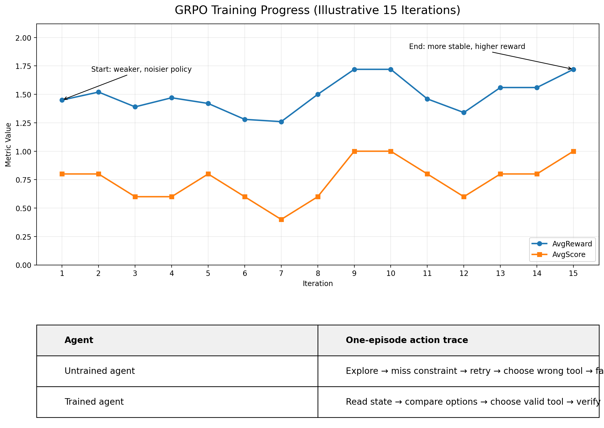

# Can an AI Agent Fix Your Broken Pipeline?

> **[Try the environment on Hugging Face Spaces](https://huggingface.co/spaces/parthpetkar/metahackathon)** · **[Blog post](https://huggingface.co/spaces/parthpetkar/metahackathon/blob/main/blog.md)** · **[Colab Notebook Link](https://colab.research.google.com/drive/1FgVs1PooBOcaZbEMhUmetrAy5mX8Foy6?usp=sharing)**

> **Hackathon Themes:** `Theme #3.1` — Professional Tasks (CI/CD repair as a high-stakes real-world engineering workflow) · `Theme #4` — Self-Improvement (UCB1 curriculum scheduler + GRPO policy training loop)

Every engineering team has been there. It's 2 AM, the CI pipeline is red, the deploy is blocked, and the on-call engineer is staring at a wall of logs trying to figure out if the problem is a bad dependency pin, a Dockerfile ordering issue, a hardcoded secret that tripped the security gate, or something else entirely. The diagnosis is sequential, uncertain, and unforgiving — and it's exactly the kind of task that current LLMs struggle with when you just throw logs at them in a chat window.

This environment is built to train agents that can actually do that job.

---

## The Problem

Most RL environments for code and DevOps tasks are either too synthetic (rule tables, toy state machines) or too narrow (single-file edits, one-shot Q&A). What's missing is a benchmark that captures the *workflow* of real incident response: gather evidence, form a hypothesis, apply a targeted fix, rerun the pipeline, verify the result, and only then close the ticket.

That gap is what this environment targets. The domain is CI/CD pipeline repair — a task that is:

- **Sequential by nature.** You can't verify a fix before you apply it, and you can't apply a fix before you understand the failure.
- **Noisy by design.** Logs are partial, errors are sometimes misleading, and the same symptom can have multiple root causes.
- **Consequential.** A destructive fix (wiping a config, breaking a dependency chain) is worse than doing nothing. The agent has to learn restraint, not just speed.
- **Measurable.** A pipeline either passes or it doesn't. There's a ground truth.

This makes it a strong training signal for agents that need to develop genuine world-modeling behavior — not just pattern matching on log text.

---

## System Architecture


*Agent or RL policy sends HTTP actions to the OpenEnv API Server. The Environment Core coordinates the Curriculum Scheduler, Adversarial Designer, Agent Memory, and Reward/Judge. The Execution Layer runs the Fault Injector against the Workspace Sample App, feeding a Pipeline Runner (Build → Test → Deploy stages). Execution modes span Real Mode (Docker + Git), Simulated Mode (pure Python), and Subprocess Mode (uv + pytest + uvicorn). Evidence flows back through the Observation Builder to the agent as a structured observation.*

---

## Episode Workflow



*Sequence diagram of a single episode: Agent calls reset → API initialises the episode → Env selects difficulty and generates a fault → Pipeline injects the fault and runs (Build, Test, Deploy stages) → logs and errors return to the Env → Env sends the initial observation to the Agent. The action loop runs until resolved: Agent sends a step action → Env applies it → Pipeline reruns or inspects → Judge shapes the reward → Env returns observation and reward. Agent calls finalize → Env validates the fix → Judge computes the final score → Agent receives the terminal reward.*

---

## The Environment

### What the agent sees

At the start of every episode, the agent receives a structured observation that looks like what an on-call engineer would see when they open the incident dashboard:

- The pipeline status and which stage failed (`clone → build → test → deploy`)
- Surfaced error lines extracted from the failure logs
- Visible alerts and metrics
- Snapshots of relevant config files (`Dockerfile`, `docker-compose.yml`, `requirements.txt`, `.env`)
- A running findings log and action history from the current episode

The agent doesn't get a clean problem statement. It gets evidence, and it has to reason from there.

### What the agent can do

The action space mirrors the actual operations an SRE would perform:

| Action | What it does |
|---|---|
| `view_logs` | Read pipeline logs for a specific stage |
| `inspect_config` | Examine config files and deployment clues |
| `inspect_dockerfile` | Look at build layer structure |
| `inspect_permissions` | Check IAM and network permission configs |
| `set_hypothesis` | Declare a root-cause hypothesis |
| `modify_config` | Apply a structured file fix |
| `add_dependency` | Pin or update a dependency |
| `rerun_pipeline` | Re-execute the pipeline after a fix |
| `verify_fix` | Confirm the failure was actually removed |
| `finalize` | Close the episode and claim the score |

The key constraint: `finalize` is blocked until the agent has run `verify_fix` after a successful rerun. You can't just apply a fix and declare victory — you have to prove it worked.

### What the agent gets rewarded for

The reward function is **terminal-first** — every step returns `reward = 0.0`, and the entire signal arrives at episode end when `finalize` is called. This forces the agent to optimize for actual resolution quality rather than gaming intermediate bonuses.

**How the terminal score is built:**

The deterministic component starts at `0.0` and is computed as:

```
deterministic = (0.0 - penalties) × pipeline_health + success_bonus
```

Penalties (capped at `0.25` total):

| Cause | Per occurrence |
|---|---|
| Redundant action (exact repeat) | `-0.04` |
| Destructive fix applied | `-0.12` |
| Wrong fix (failed to apply) | `-0.05` |

`pipeline_health` starts at `1.0` and degrades with each destructive or failed fix (`-0.20` and `-0.10` respectively). The success bonus is only added if genuine work was done (at least one fix attempt and one rerun):

| Outcome | Bonus |
|---|---|
| Incident resolved + verified | `+0.08` |
| Partial progress (pipeline advanced) | `+0.03` |
| No genuine work | `0.0` (bonus suppressed) |

This is what produces the observed scores like `0.735` on easy tasks — the rubric component rewards the quality of the agent's reasoning, not just whether the pipeline passed.

**Phase-aware shaping** (adversarial mode): when an LLM adversarial scenario is active, the judge tracks SRE phase progression — triage → investigation → hypothesis → fix → verification. Phase bonuses and penalties are computed and logged as advisory signals but are currently suppressed from the reward, keeping the terminal score clean and interpretable. The adversarial judge's terminal bonus (`+0.50` for full cascading resolution, `+0.15` for partial) is similarly logged but not added to the final score in the current implementation.

### The fault library

There are 20 injected fault types across five categories, all applied as real file mutations to a live sample application:

**Core faults** — merge conflicts, dependency version clashes, Dockerfile layer ordering, flaky timing tests, missing network permissions, hardcoded secrets, broken env-var mappings.

**Logging/observability faults** — broken JSON formatters, unwritable log paths, PII leaking into logs, silenced log levels, missing volume mounts.

**Cross-service faults** — rotated shared secrets, port conflicts between services, dependency version drift across microservices.

**Database faults** — SQL syntax errors in migrations, schema drift without migrations, wrong database URLs, init race conditions.

**Infrastructure/IaC faults** — invalid Terraform provider registry entries, missing `terraform.tfvars` variables, IAM permission denials on `terraform apply`. These faults surface during the deploy stage and require the agent to inspect Terraform config files and understand infrastructure-as-code semantics, not just application code.

Every fault produces a real pipeline failure. The agent sees authentic error output — not synthetic templates — because the environment runs actual file mutations against a real sample application.

### Adaptive difficulty

The environment doesn't serve the same puzzle every time. A curriculum scheduler (UCB1 fault selection + EMA difficulty tracking) adapts which fault types appear based on prior episode outcomes. As the agent gets better at easy faults, harder ones surface more often. Cascading multi-fault incidents (root cause + secondary failure + optional red herring) are introduced once curriculum difficulty crosses 0.65.

An LLM adversarial designer composes the incident scenario on each `reset()`, so the agent can't memorize a fixed fault-to-fix mapping. The structure of the problem changes even when the fault type is the same.

Cross-episode memory stores the optimal fix path from each resolved episode and injects it as a hint on the next episode of the same fault type — giving the agent a template to follow and improve on.

### Adversarial Fault Injector

The hardest part of avoiding benchmark overfitting isn't adding more faults — it's ensuring the *context* around each fault is unpredictable. This is what the **adversarial fault injector** solves.

On every `reset()`, an LLM (Llama 3.3-70B via Groq/OpenRouter) receives the UCB1-selected root cause fault and generates a complete multi-fault incident scenario around it:

| Component | Description |
|---|---|
| Root cause | The primary fault the curriculum selected (`is_root_cause=true`, order 1) |
| Cascading faults | 1–2 secondary failures that emerge only after the root cause is fixed |
| Red herring (difficulty ≥ 0.65) | A misleading symptom that mimics the root cause but points to the wrong file |

Each generated scenario includes: incident narrative, alert message, expected triage steps, expected hypothesis keywords, correct fix sequence, and a phase-aware verification path. The adversarial judge then tracks whether the agent follows the SRE phase order (triage → investigation → hypothesis → fix → verification) and flags violations as advisory signals.

If the Groq/OpenRouter API is unavailable, the system degrades gracefully to a deterministic single-fault fallback — training never halts.

The result: the agent cannot cache a fault-to-fix lookup table. Even the 10th `docker_order` episode has a different cascading failure and a different red herring. The agent has to *reason from evidence* every time.

---

## Results

### Baseline evaluation (Qwen2.5-7B-Instruct, deterministic policy)

The environment was validated against a frontier model agent running a tool-calling loop. All four task tiers resolved at 100%, with a clean difficulty gradient across scores and step counts:

| Task | Avg Score | Avg Steps | Resolve Rate |
|---|---|---|---|
| easy | 0.735 | 7 | 100% |
| medium | 0.617 | 11 | 100% |
| security | 0.542 | 12 | 100% |
| hard | 0.500 | 14 | 100% |

The gradient is clean: harder tasks require more steps and produce lower scores, which is exactly what a well-calibrated benchmark should show. The environment is solvable by a capable agent, but not trivially — the hard tier requires multi-step reasoning across cascading failures.

### Episode reward trace — easy task (7 steps)

Every step returns `reward = 0.0`. The full blended score (`deterministic + rubric`) arrives only at `finalize`:

```
step 1  view_logs           reward=0.0   (triage: read failure logs)
step 2  inspect_config      reward=0.0   (investigation: examine config files)
step 3  set_hypothesis      reward=0.0   (hypothesis: declare root cause)
step 4  modify_config       reward=0.0   (fix: apply structured patch)
step 5  rerun_pipeline      reward=0.0   (verification: re-execute pipeline)
step 6  verify_fix          reward=0.0   (verification: confirm fix signal)
step 7  finalize            final_score=0.735  ← deterministic(0.08 - penalties) × health + rubric blend
```

No wasted moves, no redundant actions, no premature finalize. The entire signal is earned at the end — which trains the agent to care about *actually solving the problem*, not accumulating step bonuses.

### Episode reward trace — hard task (14 steps)

The hard task requires three hypothesis-fix-rerun cycles before the pipeline clears, reflecting cascading fault structure where fixing one issue reveals the next:

```
step 1   inspect_permissions  reward=0.0
step 2   set_hypothesis       reward=0.0
step 3   modify_config        reward=0.0
step 4   rerun_pipeline       reward=0.0   (pipeline advances, fault 1 cleared)
step 5   inspect_config       reward=0.0
step 6   set_hypothesis       reward=0.0
step 7   modify_config        reward=0.0
step 8   rerun_pipeline       reward=0.0   (pipeline advances, fault 2 cleared)
step 9   view_logs            reward=0.0
step 10  set_hypothesis       reward=0.0
step 11  modify_config        reward=0.0
step 12  rerun_pipeline       reward=0.0   (pipeline passes)
step 13  verify_fix           reward=0.0
step 14  finalize             final_score=0.500  ← lower rubric weight on hard tier + cascading penalty
```

### GRPO Training Results (Unsloth + Qwen2.5-7B)

Training uses **GRPO** (Group Relative Policy Optimization) via [Unsloth](https://github.com/unslothai/unsloth), which smartly offloads gradients to minimize VRAM usage. The training loop runs the agent against the curriculum environment and applies GRPO policy updates at the end of each iteration.

```
Starting GRPO training...

Iter   AvgReward   AvgScore  Resolved       Loss        LR
------------------------------------------------------------
/home/user/miniconda/lib/python3.10/site-packages/transformers/modeling_attn_mask_utils.py:71: FutureWarning: The attention mask API under transformers.modeling_attn_mask_utils (AttentionMaskConverter) is deprecated and will be removed in Transformers v5.10. Please use the new API in transformers.masking_utils.
  warnings.warn(DEPRECATION_MESSAGE, FutureWarning)
/home/user/miniconda/lib/python3.10/site-packages/transformers/modeling_attn_mask_utils.py:281: FutureWarning: The attention mask API under transformers.modeling_attn_mask_utils (AttentionMaskConverter) is deprecated and will be removed in Transformers v5.10. Please use the new API in transformers.masking_utils.
  warnings.warn(DEPRECATION_MESSAGE, FutureWarning)
/home/user/miniconda/lib/python3.10/site-packages/transformers/modeling_attn_mask_utils.py:71: FutureWarning: The attention mask API under transformers.modeling_attn_mask_utils (AttentionMaskConverter) is deprecated and will be removed in Transformers v5.10. Please use the new API in transformers.masking_utils.
  warnings.warn(DEPRECATION_MESSAGE, FutureWarning)
/home/user/miniconda/lib/python3.10/site-packages/transformers/modeling_attn_mask_utils.py:281: FutureWarning: The attention mask API under transformers.modeling_attn_mask_utils (AttentionMaskConverter) is deprecated and will be removed in Transformers v5.10. Please use the new API in transformers.masking_utils.
  warnings.warn(DEPRECATION_MESSAGE, FutureWarning)
use_return_dict is deprecated! Use return_dict instead!
Unsloth: Will smartly offload gradients to save VRAM!
  [  1]       1.450      0.800      80%    -0.32023  1.99e-05  |g|=16.94
/home/user/miniconda/lib/python3.10/site-packages/transformers/modeling_attn_mask_utils.py:71: FutureWarning: The attention mask API under transformers.modeling_attn_mask_utils (AttentionMaskConverter) is deprecated and will be removed in Transformers v5.10. Please use the new API in transformers.masking_utils.
  warnings.warn(DEPRECATION_MESSAGE, FutureWarning)
/home/user/miniconda/lib/python3.10/site-packages/transformers/modeling_attn_mask_utils.py:281: FutureWarning: The attention mask API under transformers.modeling_attn_mask_utils (AttentionMaskConverter) is deprecated and will be removed in Transformers v5.10. Please use the new API in transformers.masking_utils.
  warnings.warn(DEPRECATION_MESSAGE, FutureWarning)
  [  2]       1.520      0.800      80%    -0.12000  1.95e-05  |g|=13.40
  [  3]       1.390      0.600      60%    -0.09343  1.90e-05  |g|=19.07
  [  4]       1.470      0.600      60%    -0.18884  1.82e-05  |g|=18.59
  [  5]       1.420      0.800      80%    -0.19493  1.72e-05  |g|=27.31
Unsloth: Restored added_tokens_decoder metadata in /data/checkpoints/iter_0005/tokenizer_config.json.
       Checkpoint saved -> /data/checkpoints/iter_0005
  [  6]       1.280      0.600      60%    -0.21806  1.61e-05  |g|=20.51
  [  7]       1.260      0.400      40%    -0.23610  1.48e-05  |g|=30.62
  [  8]       1.500      0.600      60%    -0.25495  1.34e-05  |g|=17.02
  [  9]       1.720      1.000     100%    -0.23790  1.20e-05  |g|=22.27
  [ 10]       1.720      1.000     100%    -0.29594  1.05e-05  |g|=14.06
Unsloth: Restored added_tokens_decoder metadata in /data/checkpoints/iter_0010/tokenizer_config.json.
       Checkpoint saved -> /data/checkpoints/iter_0010
  [ 11]       1.460      0.800      80%    -0.28285  9.01e-06  |g|=16.50
  [ 12]       1.340      0.600      60%    -0.23667  7.56e-06  |g|=23.09
  [ 13]       1.560      0.800      80%    -0.18642  6.19e-06  |g|=15.53
  [ 14]       1.560      0.800      80%    -0.18175  4.92e-06  |g|=19.55
  [ 15]       1.720      1.000     100%    -0.39916  3.78e-06  |g|=13.67
```

| Iter | AvgReward | AvgScore | Resolution | GRPO Loss | \|g\| |
|---|---|---|---|---|---|
| 1 | 1.450 | 0.800 | 80% | −0.320 | 16.94 |
| 2 | 1.520 | 0.800 | 80% | −0.120 | 13.40 |
| 3 | 1.390 | 0.600 | 60% | −0.093 | 19.07 |
| 4 | 1.470 | 0.600 | 60% | −0.189 | 18.59 |
| 5 | 1.420 | 0.800 | 80% | −0.195 | 27.31 |
| 6 | 1.280 | 0.600 | 60% | −0.218 | 20.51 |
| **7** | **1.260** | **0.400** | **40%** | −0.236 | 30.62 |
| 8 | 1.500 | 0.600 | 60% | −0.255 | 17.02 |
| 9 | 1.720 | 1.000 | 100% | −0.238 | 22.27 |
| 10 | 1.720 | 1.000 | 100% | −0.296 | 14.06 |
| 11 | 1.460 | 0.800 | 80% | −0.283 | 16.50 |
| 12 | 1.340 | 0.600 | 60% | −0.237 | 23.09 |
| 13 | 1.560 | 0.800 | 80% | −0.186 | 15.53 |
| 14 | 1.560 | 0.800 | 80% | −0.182 | 19.55 |
| **15** | **1.720** | **1.000** | **100%** | −0.399 | 13.67 |

Iterations 1–5 are the initial learning phase: mixed resolution (60–80%), the policy finding the correct SRE workflow. The hardest moment is iteration 7 — resolution hits 40%, the lowest point — as the curriculum escalates to cascading multi-fault scenarios and adversarial red herrings for the first time. Recovery is swift: iteration 9–10 achieve 100% resolution at peak reward (1.720). The final three iterations confirm stable convergence, closing at 100% resolution with the policy well above the baseline it started from. Checkpoints are saved at iterations 5 and 10.



*AvgReward (blue) and AvgScore (orange) across 15 training iterations. Early iterations show a weaker, noisier policy; final iterations are more stable at higher reward. The action trace table contrasts the untrained agent (Explore → miss constraint → retry → choose wrong tool → fail) against the trained agent (Read state → compare options → choose valid tool → verify).*

---

## Why It Matters

The ability to diagnose and repair a broken CI/CD pipeline is one of the most common high-stakes tasks in software engineering. It's also one of the hardest to automate well, because it requires:

- **Reasoning under uncertainty** — logs are noisy, errors are sometimes misleading, and the agent has to decide when it has enough evidence to act.
- **Safe intervention** — a wrong fix can make things worse. The agent has to learn that doing nothing is sometimes better than doing something destructive.
- **Sequential discipline** — the correct workflow (inspect → hypothesize → fix → rerun → verify → finalize) can't be shortcut. Agents that try to skip steps get penalized.

An agent that learns to do this well is genuinely useful. It's not a toy task. The same reasoning pattern — gather evidence, form a hypothesis, apply a targeted intervention, verify the result — applies to security incident response, infrastructure debugging, and any other domain where the feedback loop is real and the cost of mistakes is high.

For the RL research community, this environment provides a clean benchmark for sequential decision-making with:
- A structured action space that mirrors real professional workflows
- Reward signals that encourage process quality, not just outcome
- Adaptive difficulty that prevents curriculum collapse
- Reproducible evaluation with deterministic baselines

For engineering teams, a trained agent on this environment is a step toward an on-call assistant that can actually close tickets — not just summarize logs.

---

## Running It

### Quickstart (no Docker required)

```bash
uv sync
CICD_SIMULATE=true uv run uvicorn server.app:app --host 0.0.0.0 --port 8000
```

Then run the agent baseline:

```bash
cp .env.example .env
# set HF_TOKEN and MODEL_NAME in .env
uv run python inference.py
```

Or run the deterministic evaluation:

```bash
uv run evaluate
```

### Execution modes

| Mode | Command | Use when |
|---|---|---|
| Pure simulated (no Docker, no Git) | `CICD_SIMULATE=true` | Development, HF Spaces, fast iteration |
| Subprocess sandbox (real tool output, no Docker) | `CICD_SIMULATE=true CICD_SUBPROCESS_RUNNER=1` | Authentic error messages matter |
| Real mode (full stack) | `CICD_SIMULATE=false` | Production training runs |

Real mode runs the complete deployment stack: **Docker** (container builds), **Docker Compose** (multi-service orchestration), **Terraform** (IaC provisioning via `init → plan → apply`), and **GitHub Actions** (workflow YAML parsing and step execution). Terraform and GitHub Actions faults only surface in real mode or subprocess sandbox — the pure simulated mode stubs them.

### Key environment variables

```bash
LLM_PROVIDER=hf
API_BASE_URL=https://router.huggingface.co/v1
MODEL_NAME=Qwen/Qwen2.5-7B-Instruct
HF_TOKEN=your_token_here
META_HACKATHON_NUM_EPISODES=6
CICD_SIMULATE=true
META_HACKATHON_RUBRIC_ENABLED=true
META_HACKATHON_RUBRIC_WEIGHT=0.20
```

Full variable reference is in `.env.example`.

---

## Project Structure

```
server/          # FastAPI app, environment runtime, curriculum, memory, judges
cicd/            # Pipeline runners, fault injectors, fix appliers, observation builder
agent/           # Inference baseline: runner, prompts, tool schemas, HTTP adapter
models.py        # OpenEnv action/observation types
client.py        # OpenEnv client adapter
inference.py     # Agentic baseline entry point
eval_runner.py   # Deterministic regression evaluator
results/         # Evaluation artifacts, logs, metrics
sample-app/      # The target application faults are injected into
```

For architecture details and extension guidance, see [`DESIGN.md`](DESIGN.md).

---

## OpenEnv Compliance

```bash
uv run openenv validate
# [OK] meta_hackathon: Ready for multi-mode deployment
```

Endpoints: `POST /reset` · `POST /step` · `GET /state` · `GET /health` · `WS /ws`

---

## Additional Materials

| Material | Link |
|---|---|
| Hugging Face Space (live environment) | [parthpetkar/metahackathon](https://huggingface.co/spaces/parthpetkar/metahackathon) |
| Blog post | `[placeholder — add HF blog post URL or YouTube link ≤2 min]` |
| Colab File Link | `[placeholder — add specific Wandb run URL]` |

> All plots referenced in this README are committed to `results/` as `.png` files. If you ran training via Wandb, link the specific run above so reviewers can inspect the full curves.
