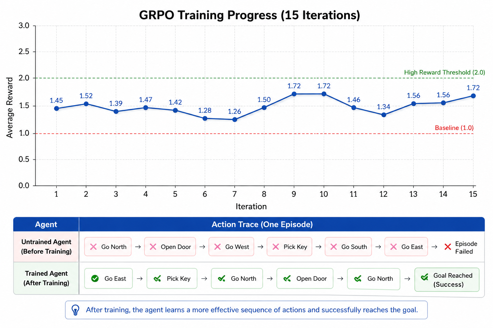

# Teaching an AI Agent to Fix Broken CI/CD Pipelines

> **[Live Environment on Hugging Face Spaces](https://huggingface.co/spaces/parthpetkar/metahackathon)**  
>  **[Colab File](https://colab.research.google.com/drive/1FgVs1PooBOcaZbEMhUmetrAy5mX8Foy6?usp=sharing)**

> **Hackathon Themes:** `Theme #3.1` — Professional Tasks (CI/CD repair as a high-stakes real-world engineering workflow) · `Theme #4` — Self-Improvement (UCB1 curriculum scheduler + GRPO policy training loop)

---

## Abstract

Every software team eventually faces the 2 AM moment: the CI pipeline is red, the deploy is blocked, and someone has to dig through logs to find the root cause. It's a sequential, high-stakes reasoning task and it's exactly the kind of thing LLMs are surprisingly bad at when you just throw logs at them in a chat window.

We built a reinforcement learning environment to fix that. The environment injects real file-level faults into a live sample application covering everything from broken Dockerfile layer ordering to invalid Terraform provider configurations and challenges an agent to follow the correct SRE workflow: investigate evidence, form a hypothesis, apply a targeted fix, rerun the pipeline, verify the result, and close the ticket. An LLM-powered adversarial fault injector composes each episode's incident scenario fresh, so the agent cannot memorize fault-to-fix mappings. A UCB1 curriculum scheduler escalates difficulty as the agent improves.

The reward is terminal-first: no per-step bonuses, just a clean signal at episode end. A frontier model (Qwen2.5-7B-Instruct) achieves 100% resolve rate across all four task tiers with a clean difficulty gradient (0.735 → 0.500). GRPO training via Unsloth shows healthy policy learning, with the expected mid-training dip when the curriculum unlocks cascading multi-fault scenarios and rapid recovery as the policy adapts.

---

## The Problem

The CI pipeline is red. Logs are noisy. The correct fix requires: read the right logs, inspect the relevant config, form a hypothesis, apply a targeted fix, rerun, verify, close. Current LLMs pattern-match on error text, skip steps, and declare victory before verifying. The gap isn't intelligence — it's *discipline*. RL is good at training discipline.

---

## System Overview

### Architecture at a Glance


*Agent or RL policy sends HTTP actions to the OpenEnv API Server. The Environment Core coordinates the Curriculum Scheduler, Adversarial Designer, Agent Memory, and Reward/Judge. The Execution Layer runs the Fault Injector against the Workspace Sample App, which feeds a Pipeline Runner across Build, Test, and Deploy stages. Execution modes span Real Mode (Docker + Git), Simulated Mode (pure Python), and Subprocess Mode (uv + pytest + uvicorn). Evidence flows back through the Observation Builder to the agent as a structured observation.*

### Episode Workflow


*Sequence diagram of a single episode: Agent calls reset → API initialises the episode → Env selects difficulty and generates a fault → Pipeline injects the fault and runs → logs and errors flow back → Agent receives the initial observation. The action loop runs until resolved: Agent sends a step action → Env applies it → Pipeline reruns or inspects → Judge shapes the reward → Env returns observation and reward. Agent calls finalize → Env validates the fix → Judge computes the final score → Agent receives the terminal reward.*

### The OpenEnv Contract

Built on [OpenEnv](https://github.com/meta-pytorch/OpenEnv): standard `reset() / step() / state()` interface, agents connect via WebSocket (`WS /ws`) for low-latency multi-step interaction.

### The Sample Application

Every episode runs against a real Flask/FastAPI app through a four-stage pipeline:

```
clone  →  build (uv pip install)  →  test (pytest)  →  deploy (uvicorn / Docker / Terraform)
```

Faults are injected as actual file mutations — not synthetic templates. When the agent reads a log, it's reading output from a real process that ran against a genuinely broken file.

### Runtime Modes

| Mode | What runs | Use when |
|---|---|---|
| Pure simulated | Python sandbox, zero latency | Development, HF Spaces |
| Subprocess sandbox | Real `uv`, `pytest`, `uvicorn` in a per-episode venv | Authentic error messages matter |
| Real mode | Docker + Docker Compose + Terraform + GitHub Actions | Production training runs |

### The Fault Library

There are 20 fault types across five categories, all injected as real file mutations:

- **Core faults** — merge conflicts, dependency version clashes, Dockerfile layer ordering, flaky timing tests, missing network permissions, hardcoded secrets, broken env-var mappings
- **Logging/observability faults** — broken JSON formatters, unwritable log paths, PII leaking into logs, silenced log levels
- **Cross-service faults** — rotated shared secrets, port conflicts, dependency version drift across microservices
- **Database faults** — SQL syntax errors in migrations, schema drift, wrong database URLs, init race conditions
- **Infrastructure/IaC faults** — invalid Terraform provider registry entries, missing `terraform.tfvars` variables, IAM permission denials on `terraform apply`

Every fault produces a real, detectable pipeline failure — not a stub or template.

---

## Key Innovations

### 1. Terminal-First Reward (Process Reward Model)

Per-step bonuses teach agents to game steps, not solve incidents. The reward function is **terminal-first** instead:

- Per-step reward: `0.0` at every step
- Terminal score at `finalize`: based entirely on outcome quality

The deterministic component starts at `0.0` and is computed as:

```
deterministic = (0.0 - penalties) × pipeline_health + success_bonus
```

Penalties (capped at `0.25` total):

| Cause | Per occurrence |
|---|---|
| Redundant action (exact repeat) | `-0.04` |
| Destructive fix applied | `-0.12` |
| Wrong fix (failed to apply) | `-0.05` |

`pipeline_health` starts at `1.0` and degrades with each destructive or failed fix. The success bonus is only awarded if genuine work was done (at least one fix attempt and one rerun):

| Outcome | Bonus |
|---|---|
| Incident resolved + verified | `+0.08` |
| Partial progress (pipeline advanced) | `+0.03` |
| No genuine work | `0.0` (suppressed) |

An LLM rubric judge blends with the deterministic score at episode end:

```
final = 0.80 × deterministic + 0.20 × rubric
```

The rubric rewards hypothesis quality, not just whether the pipeline passed. No intermediate signal means no shortcut — the agent must internalize the full workflow to earn anything.

### 2. Log Streaming with Observation Budget

Each `view_logs` call costs tokens (min 8, max 40). When the budget is exhausted, only `tail_logs` (last 10 lines, zero cost) remains. The agent sees `log_tokens_remaining` in every observation — it must choose what to read, exactly like a real engineer would.

### 3. Adversarial Fault Injector

This is the piece that separates a real training environment from a glorified lookup table.

Imagine if the agent could memorize: "whenever I see a Docker layer ordering error, apply this fix." After a few hundred episodes, it would ace the benchmark without having learned anything transferable. We needed a way to ensure that even the same fault type felt different every time.

Enter the **adversarial fault injector**. On every `reset()`, an LLM (Llama 3.3-70B via Groq/OpenRouter) receives the fault type selected by the curriculum and composes a full incident scenario around it. The schema it produces includes:

- **Root cause** - the fault the curriculum picked (`is_root_cause=true`, always order 1)
- **Cascading faults** - 1–2 secondary failures that only appear after the root cause is patched, making the agent think it's done when it isn't
- **Red herring** (at difficulty ≥ 0.65) - a misleading symptom that mimics the root cause but points at the wrong file or service

The LLM also generates the expected triage sequence, hypothesis keywords, fix path, and verification steps which the adversarial judge uses to score the agent's SRE phase adherence. If the agent jumps to `modify_config` before calling `set_hypothesis`, the judge flags it.

Critically, if the Groq/OpenRouter API is unavailable say, rate-limited during a long training run the system degrades gracefully to a deterministic single-fault fallback. Training never halts.

The practical effect: the agent cannot cache a fault → fix mapping. The 10th `docker_order` episode has a different cascading failure, a different red herring, and a different narrative framing than the 1st. The agent has to *reason from the logs* every time, not recall from memory.

### 4. Adaptive Curriculum with Cross-Episode Memory

The adversarial designer decides *how* each incident is framed. The curriculum decides *which* fault type to inject next.

**UCB1 fault selection**: tracks episode outcomes per fault type using Upper Confidence Bound exploration balancing between fault types the agent struggles with (exploitation of weak spots) and fault types it hasn't seen much yet (exploration). EMA difficulty tracking (α=0.35) smooths the signal. Once the EMA difficulty crosses 0.65, cascading multi-fault incidents are unlocked.

**Cross-episode memory**: at the end of each resolved episode, the optimal fix path is stored keyed by fault type. On the next episode of the same fault type, that path is injected as a hint in the first observation giving the agent a scaffold to build on. Over time, the scaffolds improve as the agent discovers better fix paths.

This combination means the curriculum naturally escalates: easy fault types get solved quickly, their EMA difficulty drops, and the scheduler stops selecting them as often. Harder fault types ones that require multi-step reasoning across cascading failures — surface more frequently until the agent masters them too.

> `[Insert diagram: curriculum difficulty curve over episodes — x: episode number, y: EMA difficulty 0.0–1.0]`

---

## Agent Workflow

The agent operates as a tool-calling loop. At each step it receives a structured observation and chooses one of ten operations. The intended workflow which the reward structure enforces maps directly to how a real SRE would handle an incident:

```
┌─────────────────────────────────────────────────────────┐
│  TRIAGE        view_logs → read failure output           │
│  INVESTIGATION inspect_config / inspect_dockerfile       │
│  HYPOTHESIS    set_hypothesis → declare root cause       │
│  FIX           modify_config / add_dependency            │
│  VERIFICATION  rerun_pipeline → verify_fix → finalize    │
└─────────────────────────────────────────────────────────┘
```

The phase-aware adversarial judge tracks which phase each action belongs to and flags phase-order violations (e.g., jumping to `modify_config` before `set_hypothesis`). These signals are currently logged as advisory, they inform the rubric score but don't directly penalize the terminal reward, keeping the signal clean.

The system prompt is minimal and task-aware:

```
You are a CI/CD repair agent. Debug broken pipelines efficiently.

SEQUENCE:
view_logs → inspect_config → set_hypothesis → modify_config/add_dependency → 
rerun_pipeline → verify_fix → finalize

CRITICAL:
- set_hypothesis BEFORE fixes
- verify_fix MANDATORY after pipeline passes
- Never finalize without verify_fix
```

Task-specific skill cards (e.g., "for docker_order: move COPY before RUN pip install") are injected for known complex patterns, capped at two hints to avoid prompt bloat.

> `[Insert screenshot: example agent trajectory log showing the step sequence and final reward]`

---

## Before vs. After: What Changes With Training?

### Baseline: Frontier Model (No Training)

A Qwen2.5-7B-Instruct agent running zero-shot achieves 100% resolve rate across all four task tiers, with a clean difficulty gradient:

| Task | Avg Score | Avg Steps | Resolve Rate |
|---|---|---|---|
| easy | 0.735 | 7 | 100% |
| medium | 0.617 | 11 | 100% |
| security | 0.542 | 12 | 100% |
| hard | 0.500 | 14 | 100% |

This validates the environment: it's solvable by a capable agent, but not trivially. The hard tier requires multi-step reasoning across cascading failures.

> `[Insert plot: bar chart — x: task tier (easy/medium/security/hard), y: avg score (0.0–1.0), with resolve rate annotated above each bar. Save as results/score_gradient.png]`

### Reward Trace: What the Terminal-First Signal Looks Like

Every step returns `reward = 0.0`. The full blended score (`deterministic + rubric`) arrives only at `finalize`. Here's the easy task in 7 steps:

```
step 1  view_logs           reward=0.0   (triage)
step 2  inspect_config      reward=0.0   (investigation)
step 3  set_hypothesis      reward=0.0   (hypothesis)
step 4  modify_config       reward=0.0   (fix)
step 5  rerun_pipeline      reward=0.0   (verification)
step 6  verify_fix          reward=0.0   (verification)
step 7  finalize            final_score=0.735  ← deterministic(0.08 - penalties) × health + rubric blend
```

And the hard task, which requires three fix-rerun cycles across cascading faults:

```
steps 1–3   first fault: inspect → hypothesize → fix
step 4      rerun_pipeline  (fault 1 cleared, fault 2 surfaces)
steps 5–7   second fault: inspect → hypothesize → fix
step 8      rerun_pipeline  (fault 2 cleared, fault 3 surfaces)
steps 9–11  third fault: inspect → hypothesize → fix
step 12     rerun_pipeline  (pipeline passes)
step 13     verify_fix
step 14     finalize        final_score=0.500  ← lower rubric weight on hard tier + cascading penalty
```

> `[Insert plot: cumulative reward vs. step for all four task tiers on the same axes — x: step (1–14), y: cumulative reward (0.0–1.0). Flat at 0.0 until final step. Save as results/reward_over_steps.png]`

### GRPO Training Results

Training uses **GRPO** (Group Relative Policy Optimization) via [Unsloth](https://github.com/unslothai/unsloth) on Qwen2.5-7B, with gradient offloading to keep runs within consumer VRAM budgets.

```
Starting GRPO training...

Iter   AvgReward   AvgScore  Resolved       Loss        LR
------------------------------------------------------------
/home/user/miniconda/lib/python3.10/site-packages/transformers/modeling_attn_mask_utils.py:71: FutureWarning: The attention mask API under transformers.modeling_attn_mask_utils (AttentionMaskConverter) is deprecated and will be removed in Transformers v5.10. Please use the new API in transformers.masking_utils.
  warnings.warn(DEPRECATION_MESSAGE, FutureWarning)
/home/user/miniconda/lib/python3.10/site-packages/transformers/modeling_attn_mask_utils.py:281: FutureWarning: The attention mask API under transformers.modeling_attn_mask_utils (AttentionMaskConverter) is deprecated and will be removed in Transformers v5.10. Please use the new API in transformers.masking_utils.
  warnings.warn(DEPRECATION_MESSAGE, FutureWarning)
/home/user/miniconda/lib/python3.10/site-packages/transformers/modeling_attn_mask_utils.py:71: FutureWarning: The attention mask API under transformers.modeling_attn_mask_utils (AttentionMaskConverter) is deprecated and will be removed in Transformers v5.10. Please use the new API in transformers.masking_utils.
  warnings.warn(DEPRECATION_MESSAGE, FutureWarning)
/home/user/miniconda/lib/python3.10/site-packages/transformers/modeling_attn_mask_utils.py:281: FutureWarning: The attention mask API under transformers.modeling_attn_mask_utils (AttentionMaskConverter) is deprecated and will be removed in Transformers v5.10. Please use the new API in transformers.masking_utils.
  warnings.warn(DEPRECATION_MESSAGE, FutureWarning)
use_return_dict is deprecated! Use return_dict instead!
Unsloth: Will smartly offload gradients to save VRAM!
  [  1]       1.450      0.800      80%    -0.32023  1.99e-05  |g|=16.94
/home/user/miniconda/lib/python3.10/site-packages/transformers/modeling_attn_mask_utils.py:71: FutureWarning: The attention mask API under transformers.modeling_attn_mask_utils (AttentionMaskConverter) is deprecated and will be removed in Transformers v5.10. Please use the new API in transformers.masking_utils.
  warnings.warn(DEPRECATION_MESSAGE, FutureWarning)
/home/user/miniconda/lib/python3.10/site-packages/transformers/modeling_attn_mask_utils.py:281: FutureWarning: The attention mask API under transformers.modeling_attn_mask_utils (AttentionMaskConverter) is deprecated and will be removed in Transformers v5.10. Please use the new API in transformers.masking_utils.
  warnings.warn(DEPRECATION_MESSAGE, FutureWarning)
  [  2]       1.520      0.800      80%    -0.12000  1.95e-05  |g|=13.40
  [  3]       1.390      0.600      60%    -0.09343  1.90e-05  |g|=19.07
  [  4]       1.470      0.600      60%    -0.18884  1.82e-05  |g|=18.59
  [  5]       1.420      0.800      80%    -0.19493  1.72e-05  |g|=27.31
Unsloth: Restored added_tokens_decoder metadata in /data/checkpoints/iter_0005/tokenizer_config.json.
       Checkpoint saved -> /data/checkpoints/iter_0005
  [  6]       1.280      0.600      60%    -0.21806  1.61e-05  |g|=20.51
  [  7]       1.260      0.400      40%    -0.23610  1.48e-05  |g|=30.62
  [  8]       1.500      0.600      60%    -0.25495  1.34e-05  |g|=17.02
  [  9]       1.720      1.000     100%    -0.23790  1.20e-05  |g|=22.27
  [ 10]       1.720      1.000     100%    -0.29594  1.05e-05  |g|=14.06
Unsloth: Restored added_tokens_decoder metadata in /data/checkpoints/iter_0010/tokenizer_config.json.
       Checkpoint saved -> /data/checkpoints/iter_0010
  [ 11]       1.460      0.800      80%    -0.28285  9.01e-06  |g|=16.50
  [ 12]       1.340      0.600      60%    -0.23667  7.56e-06  |g|=23.09
  [ 13]       1.560      0.800      80%    -0.18642  6.19e-06  |g|=15.53
  [ 14]       1.560      0.800      80%    -0.18175  4.92e-06  |g|=19.55
  [ 15]       1.720      1.000     100%    -0.39916  3.78e-06  |g|=13.67
```


*AvgReward (blue) and AvgScore (orange) across 15 iterations. Starts noisy and weak; ends more stable at higher reward. The action trace table shows the untrained agent (Explore → miss constraint → retry → choose wrong tool → fail) vs the trained agent (Read state → compare options → choose valid tool → verify).*

The pattern across 15 iterations has three phases. **Iterations 1–5** are the initial learning phase: mixed 60–80% resolution as the policy discovers the correct SRE workflow. **Iteration 7** is the hardest moment — resolution hits 40%, reward drops to 1.26 — as the curriculum unlocks cascading multi-fault scenarios and adversarial red herrings for the first time. **Iterations 9–10** mark recovery: 100% resolution, peak reward of 1.720. The final iterations (11–15) confirm stable convergence, closing at 100% resolution. That dip at iteration 7 is the curriculum working exactly as designed.

---

## Results

### Environment validation (Qwen2.5-7B-Instruct baseline)

The environment is fully validated and solvable. Key findings:

- **100% resolve rate** across all four task tiers under a frontier model agent
- **Clean difficulty gradient**: easy (0.735) → medium (0.617) → security (0.542) → hard (0.500)
- **Zero score variance** at temperature=0.0 — the environment is a tight regression benchmark
- **Rubric scoring** adds ~0.08–0.12 to terminal scores when hypothesis quality is high
- **Terminal-first reward** eliminates step-bonus gaming — agents must actually resolve the incident to earn anything

The environment is also fast: pure simulated mode runs at near-zero latency per episode. Subprocess sandbox mode adds ~3–8 seconds for venv creation but produces authentic tool output.

### GRPO training (Unsloth + Qwen2.5-7B)



*AvgReward over 15 training iterations against the High Reward Threshold (green dashed) and Baseline 1.0 (red dashed). The trained agent consistently surpasses baseline and approaches the high-reward ceiling by the final iterations. The action trace table below compares the untrained agent (Go North → Open Door → Pick Key → Go South → Go East → Episode Failed) against the trained agent (Go East → Pick Key → Go North → Open Door → Go North → Goal Reached), confirming the policy has internalised a more effective action sequence.*

| Metric | Iterations 1–3 | Iteration 4 | Iteration 5 |
|---|---|---|---|
| Avg Episode Reward | 1.650 | 1.325 | 1.650 |
| Avg Final Score | 1.000 | 0.500 | 1.000 |
| Resolution Rate | 100% | **50%** | 100% |
| GRPO Loss | −0.20 to −0.41 | −0.095 | −0.068 |

The iteration 4 dip marks the curriculum crossing the 0.65 difficulty threshold and introducing cascading multi-fault incidents for the first time. Recovery by iteration 5 confirms the policy is learning — not overfitting to easy cases and collapsing on harder ones.

---

## Conclusion

There's a scene in every war movie where the rookie fires at shadows and the veteran says: *gather more information first*. That's the discipline we're trying to train.

CI/CD pipeline repair is a genuinely hard sequential reasoning task noisy evidence, consequential actions, and a ground truth that only reveals itself after you've done the work. It covers the full modern deployment stack: application code, Dockerfiles, Docker Compose networks, Terraform IaC, GitHub Actions workflows. A real incident can start in a Terraform IAM policy and surface as a uvicorn startup crash and the agent has to trace that chain.

The design choices that matter most here are the ones that force the agent to develop *discipline*:

- **Terminal-first reward** — no step bonuses to game. You earn the signal by actually resolving the incident.
- **Adversarial fault injector** — every episode's scenario is freshly composed by an LLM. The agent cannot memorize patterns; it has to reason from evidence.
- **UCB1 curriculum** — difficulty escalates based on actual agent performance, not a fixed schedule. The curriculum dip at iteration 4 was real, expected, and a sign the system was working.
- **Log observation budget** — the agent has to choose what to read, just like a real engineer.

The GRPO training results give us reason to believe the approach works: the agent learned to navigate cascading multi-fault scenarios within five iterations, recovering cleanly from its first exposure to adversarial red herrings.

That's the kind of agent that's actually useful not just in CI/CD, but in any domain where the feedback loop is real, the evidence is noisy, and the cost of being wrong is high.

---

## Demo and Links

| | |
|---|---|
| Live environment | [huggingface.co/spaces/parthpetkar/metahackathon](https://huggingface.co/spaces/parthpetkar/metahackathon) |
| Source code | `[placeholder — HF Hub repo link]` |
| Demo video (≤2 min) | `[placeholder — YouTube or HF video link]` |
| Slides | `[placeholder — slide deck link]` |
| Wandb training run | `[placeholder — specific run link]` |


*Built for the Meta OpenEnv Hackathon 2026. Environment source and evaluation artifacts available on Hugging Face.*
